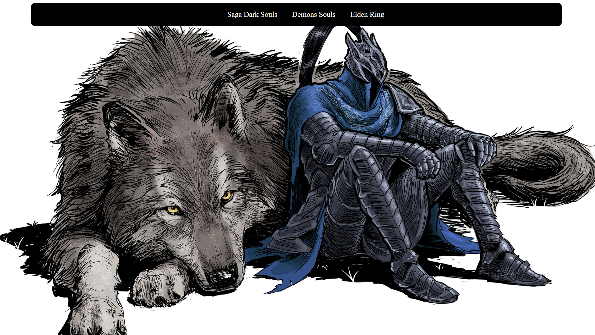
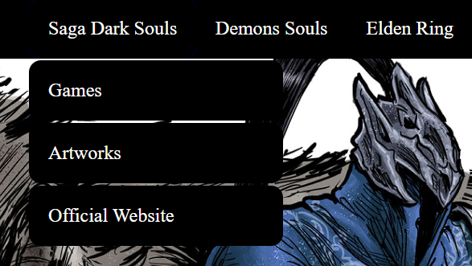

# Dark Souls Themed Menu

This project is a functional menu developed as a classroom assignment using HTML and CSS. The design is inspired by the _Dark Souls_ game series.

### Project Overview

*   **Objective:**
    *   Create a functional menu with a theme of choice.
*   **Theme:**
    *   _Dark Souls_ inspired design with elements that reflect the game's dark and medieval style.

 

### How to Use

1.  **Clone the Repository:**
    *   Use Git to clone the repository to your local machine.
    *   Example: `git clone https://github.com/YourUsername/CreativeThemedMenuWithCustomStyling.git`

2.  **Run the Project:**
    *   Open the `index.html` file in your web browser to view and interact with the menu.

### Credits

Developed by Mateus S.  
GitHub: Matz-Turing
